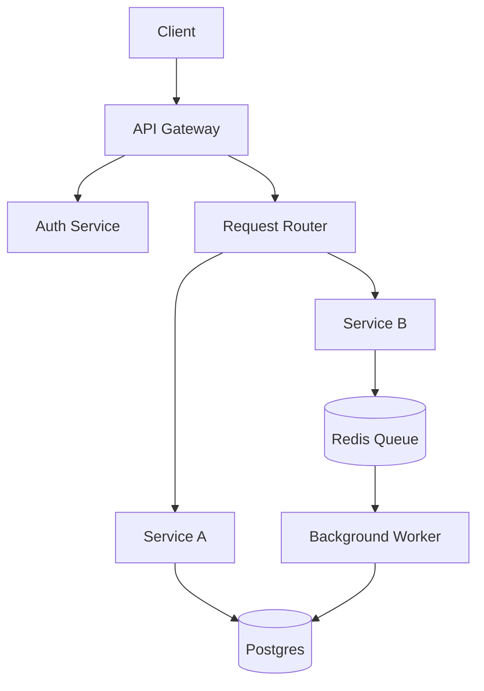
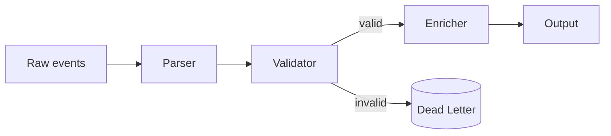
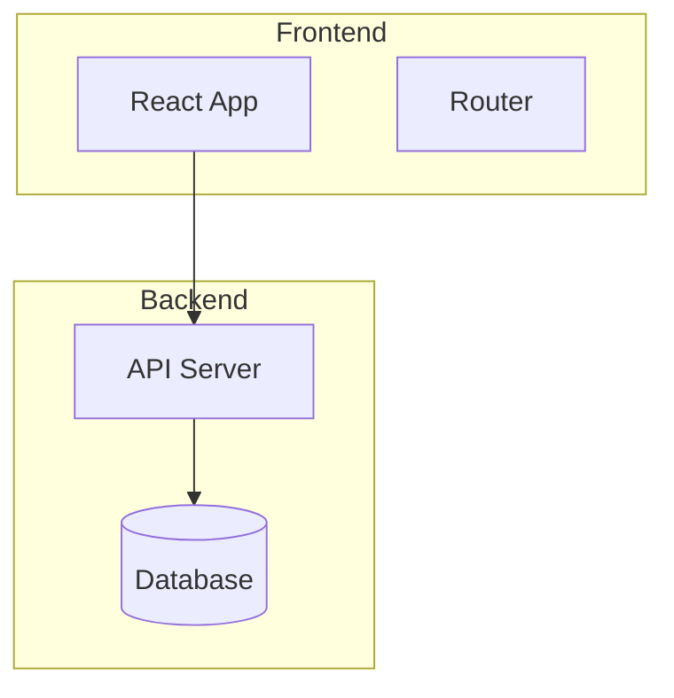
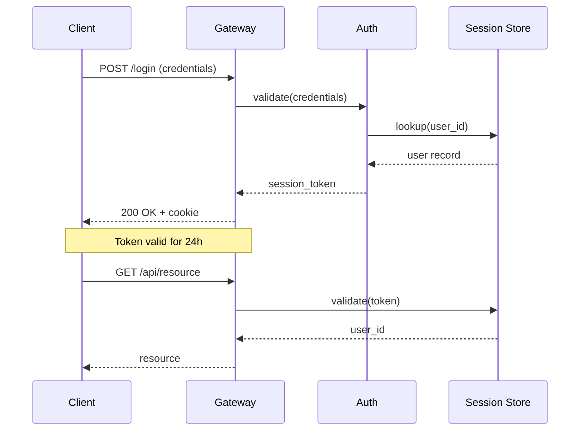
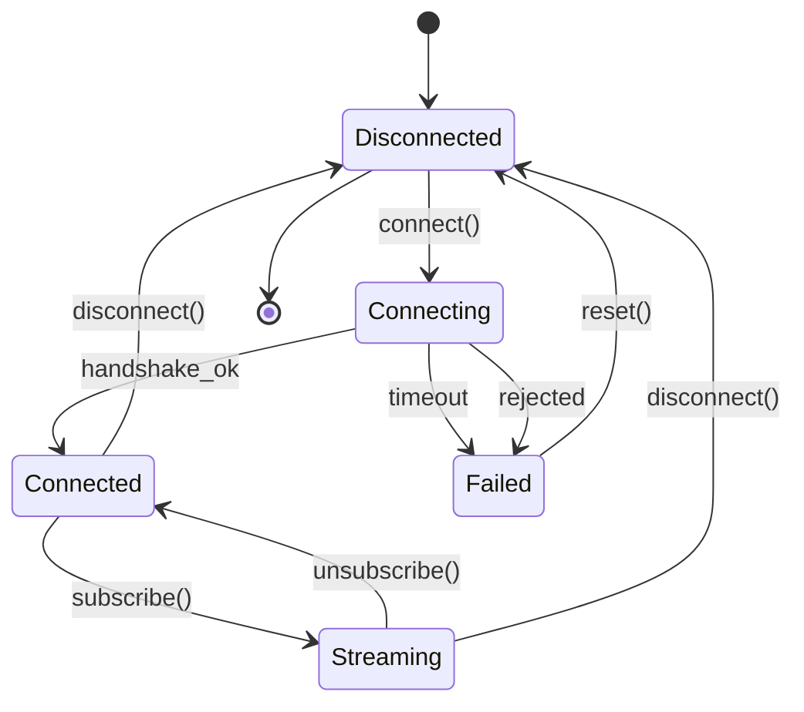
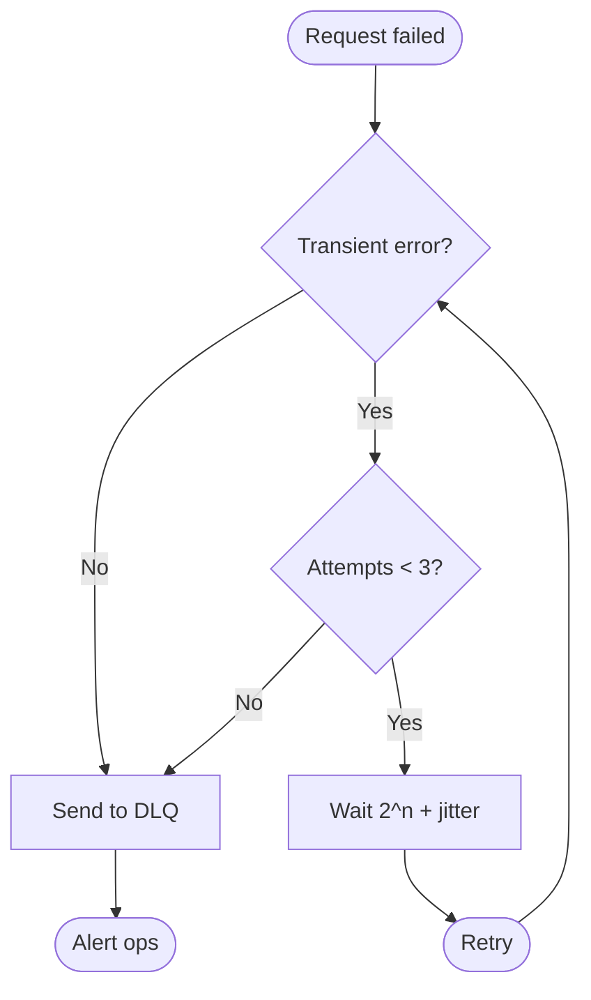

# Mermaid Diagram Types — Reference

> Hướng dẫn khi nào dùng loại diagram nào trong sách kỹ thuật. Mọi diagram dùng Mermaid format (```mermaid fenced code blocks) — render native trên GitHub và hầu hết web framework.

## Decision: Khi nào dùng loại nào?

| Concept to show | Diagram type | Example use |
|---|---|---|
| Component / module relationships | `graph TD` or `graph LR` | "System architecture overview" |
| Data flow through pipeline | `graph LR` with labels on edges | "How a request moves through layers" |
| State transitions over time | `stateDiagram-v2` | "Connection state machine" |
| Request/response + actors | `sequenceDiagram` | "Auth handshake lifecycle" |
| Decision tree / pipeline with branches | `flowchart TD` | "Retry decision logic" |
| Timeline / parallel execution | `gantt` | "Build phases over time" |
| Nested hierarchy / call tree | `graph TD` + subgraphs | "Handler invocation tree" |
| Entity relationships (DB schema) | `erDiagram` | "Persistence model" (rare in code books) |

## 1. `graph TD` / `graph LR` — Architecture + Data Flow

**TD** (top-down) — dùng cho hierarchy, layered architecture.
**LR** (left-to-right) — dùng cho pipeline, data flow.

### Example: System architecture



### Example: Data flow pipeline



### Style tips
- Dùng `(shape)` để phân loại: `[]` = service, `()` = storage, `{}` = decision, `([])` = terminal
- Labels trên edges khi có nhiều đường đi: `-->|condition| Target`
- Subgraphs để group:



## 2. `sequenceDiagram` — Interactions Over Time

Dùng khi có NHIỀU ACTORS (≥2) và thứ tự message matter. Không dùng cho internal data flow (dùng graph LR thay).

### Example: Auth handshake



### Style tips
- `->>` = sync call, `-->>` = response, `-)` = async
- `Note over A,B: text` cho context chú thích
- `alt / else / end` cho branching logic
- `loop` cho retry/polling patterns

## 3. `stateDiagram-v2` — State Machines

Dùng khi object có finite states và transitions theo events.

### Example: Connection lifecycle



### Style tips
- `[*]` = initial/final pseudo-state
- `State: condition` cho transition condition
- `State --> State: event` cho triggered transition
- `state "Custom Label" as S1` để rename

## 4. `flowchart TD` — Decision Trees

Dùng khi có branching logic, không phải architecture. Similar to graph TD but optimized cho rhombus decisions.

### Example: Retry decision



### Style tips
- `([])` = start/end terminals
- `{}` = decision diamond
- `[]` = process step
- Label edges với condition

## 5. `gantt` — Timeline / Parallel Execution

Dùng khi show phase overlap, parallel stages, deadlines.

### Example: Build pipeline

```mermaid
gantt
    title CI Pipeline Stages
    dateFormat s
    axisFormat %S
    
    section Test
    Lint           :0, 30
    Unit tests     :0, 90
    Integration    :30, 180
    
    section Build
    Compile        :90, 120
    Package        :120, 30
    
    section Deploy
    Staging        :150, 60
    Smoke tests    :210, 30
    Production     :240, 60
```



### Style tips
- `section` để group parallel tracks
- `Task :start, duration` hoặc `Task :start, end`
- Dùng cho architecture sequencing, ít khi dùng trong code books

## Diagram Count Per Chapter

| Chapter type | Diagram count | Typical mix |
|---|---|---|
| Foundation (startup, state) | 2 | 1 architecture + 1 state machine |
| Core loop | 3-4 | 1 architecture + 1 sequence + 1-2 data flow |
| Capability (tools) | 2-3 | 1 architecture + 1 data flow + 1 decision tree |
| Advanced (multi-agent) | 3-4 | 1 architecture + 2 sequence + 1 state machine |
| Infrastructure (UI, network) | 2 | 1 architecture + 1 sequence |
| Performance chapter | 2-3 | 1 data flow + 1 gantt/sequence |
| Epilogue / synthesis | 1 | 1 overview diagram tying everything |

**Target:** 2-4 diagrams per chapter. Tổng toàn sách khoảng 25-50 Mermaid diagrams.

## Anti-patterns

### ❌ Diagram thay prose
Không dùng diagram nếu prose ngắn hơn diagram. "A depends on B" không cần diagram.

### ❌ Mega-diagram
Diagram có >15 nodes là dấu hiệu chapter cần split hoặc cần break diagram thành 2-3 subgraphs.

### ❌ Labels dài
Node labels >3 từ làm diagram khó đọc. Dùng symbol + giải thích dưới.

### ❌ Repeat trong nhiều chapter
Mỗi diagram có canonical home (một chapter). Chapter khác reference: "see Figure 5-2" — không redraw.

## Mermaid rendering fallback

Nếu Mermaid không render (rare), block vẫn readable as ASCII-ish text. Không dùng Mermaid features mới (Mermaid 10+) — stick with stable subset: `graph`, `sequenceDiagram`, `stateDiagram-v2`, `flowchart`, `gantt`.

**Avoid:** `timeline`, `mindmap`, `quadrantChart`, `C4`, `sankey` — rendering không consistent cross-platform.
